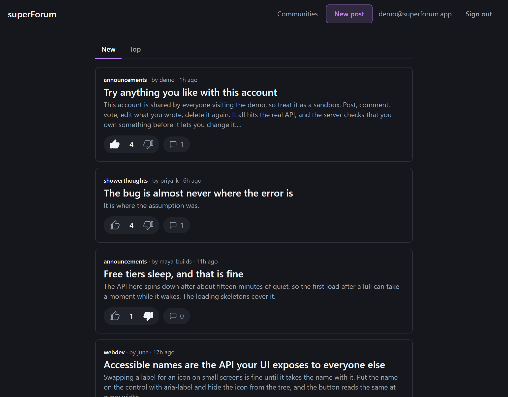
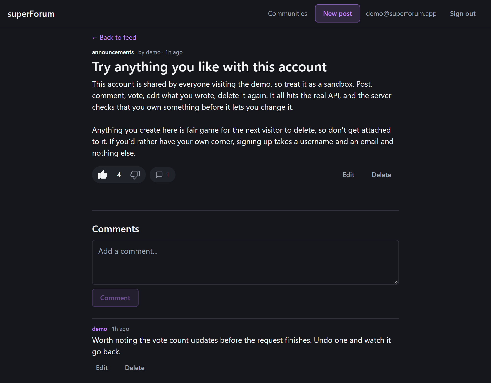
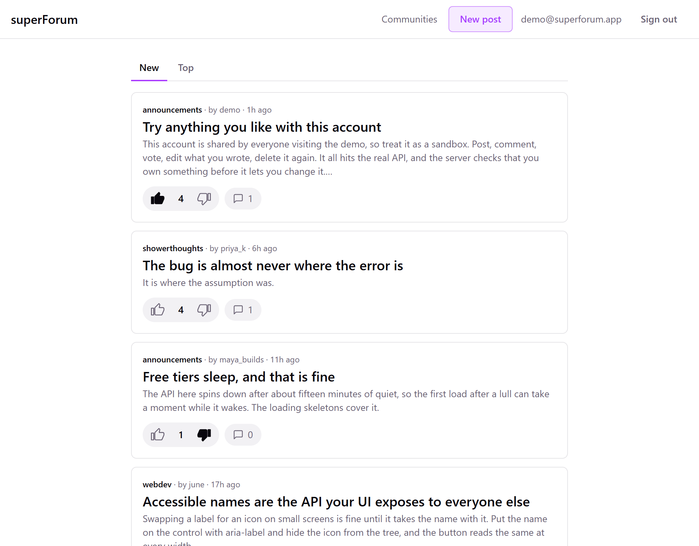
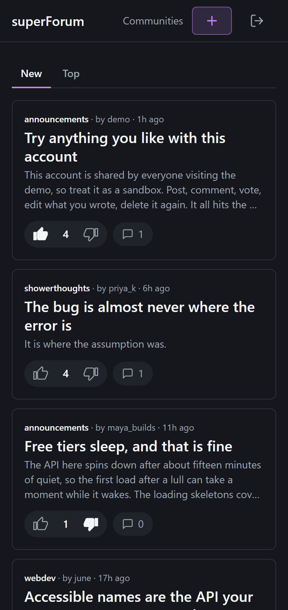

# superForum

[](https://github.com/andrebalassiano/superForum/actions/workflows/ci.yml)
[](https://codecov.io/gh/andrebalassiano/superForum)

superForum is a Reddit-style forum. People sign up, start communities, write posts and comments, and vote on them. It comes in two halves: a REST API written in TypeScript on Express 5, with Prisma 7 talking to a Postgres database and Supabase handling authentication, and a React single-page client built against it. Every write is authenticated with a server-verified JWT and validated with Zod before it reaches the database.

It's live at **[superforum.vercel.app](https://superforum.vercel.app)**, with a shared demo account on the sign-in page so you can post and vote without registering. The API runs on a free tier that sleeps when idle, so the first load after a quiet spell can take up to a minute.



**Built with:** TypeScript, Express 5, Prisma 7, PostgreSQL, Supabase, Zod, React 19, Vite, TanStack Query, Tailwind, Vitest, supertest, Docker, GitHub Actions.

I built it partly as a learning project and partly as a reference for how I like to structure a Node backend, so the emphasis throughout is on a clean, predictable layout rather than clever shortcuts. The API lives at the repository root; the client lives in `web/` as a self-contained project with its own toolchain.

## Contents

- [How it's organized](#how-its-organized)
- [The API](#the-api)
- [Try it in Postman](#try-it-in-postman)
- [A few decisions worth explaining](#a-few-decisions-worth-explaining)
- [The data model](#the-data-model)
- [The web client](#the-web-client)
- [Running it locally](#running-it-locally)
- [Tests](#tests)
- [Deployment](#deployment)
- [Where it stands](#where-it-stands)

## How it's organized

Each feature lives in its own module under `src/modules`: `auth`, `communities`, `posts`, `comments`, and `votes`. Every module splits into the same four layers. A router declares the routes and hangs the middleware off them. A controller deals with the request and the response and nothing else. A service holds the business logic. A repository is the only place that talks to Prisma. A request flows router → controller → service → repository on the way in, and back out the same way.

The point of that separation is that each layer only knows about the one beneath it. The controller doesn't know Prisma exists, and the repository doesn't know what an HTTP status code is. It makes the code easy to follow and easy to test a layer at a time. The shared middleware (the two auth guards and the Zod validators) lives in `src/middleware` and gets composed onto routes as needed. The app itself is small. `src/app.ts` builds the Express app and mounts everything under `/api`, and `src/server.ts` starts it on whatever port the environment gives it, defaulting to 3000.

## The API

Reads are generally public and writes need a bearer token. Some reads sit in between: they work anonymously, but send a valid token and the response is personalized with your own vote on each row. Those are marked **public+** below. Every path is relative to `/api`.

| Method and path | What it does | Auth |
| --- | --- | --- |
| `POST /auth/profile` | Create the signed-in user's profile | required |
| `GET /auth/me` | The caller's own profile | required |
| `GET /auth/profiles/:id` | Any profile, by id | public |
| `GET /communities` | List communities, paginated | public |
| `POST /communities` | Create a community | required |
| `GET /communities/:id` | Read one community | public |
| `PATCH` `DELETE /communities/:id` | Update or remove it, owner only | required |
| `GET /communities/:id/posts` | That community's feed | public+ |
| `GET /posts` | The main feed, paginated and sortable | public+ |
| `POST /posts` | Write a post | required |
| `GET /posts/:id` | Read one post | public+ |
| `PATCH` `DELETE /posts/:id` | Edit or remove it, author only | required |
| `GET /posts/:postId/comments` | A post's comments, paginated | public+ |
| `POST /posts/:postId/comments` | Add a comment | required |
| `GET /comments/:id` | Read one comment | public+ |
| `PATCH` `DELETE /comments/:id` | Edit or remove it, author only | required |
| `PUT /posts/:postId/vote` | Set your vote to `1` or `-1` | required |
| `DELETE /posts/:postId/vote` | Take your vote back | required |
| `PUT` `DELETE /comments/:commentId/vote` | The same, for a comment | required |
| `GET /health` | Liveness check that runs a real query | public |

A comment is created under its post rather than at a top-level route, so the post id comes from the URL and never from the body. Voting is idempotent: `PUT` is an upsert underneath, so calling it again overwrites your previous vote instead of stacking. There's deliberately no "zero" vote, because removing one is a `DELETE`, which keeps the votes table free of meaningless rows. Every post and comment carries an aggregate `score` that reads return directly.

The four list endpoints are cursor-paginated. Pass `?limit=` (default 20, max 100) and `?cursor=` (the id of the last row you saw) and you get back a `{ items, nextCursor }` envelope, where `nextCursor` is `null` once you reach the end. Ordering is newest-first with the row id as a tiebreak, so paging stays stable when two rows share a creation time, and it leans on an index rather than counting past skipped rows the way `OFFSET` does. The two post feeds also take `?sort=new|top`, where `top` ranks by vote score and is index-backed so it stays cheap at any depth.

## Try it in Postman

The full request collection is in [`postman/`](postman/superForum.postman_collection.json), ordered as a resource lifecycle (sign in, community, post, comment, vote, teardown) so it runs top to bottom in one pass. Import it, then create an environment with `baseUrl` set to `http://localhost:3000/api` plus your `supabaseUrl` and `supabaseKey`. The collection captures the auth token and the record ids as it goes. It also runs headless with `newman`.

## A few decisions worth explaining

The one I care most about is that **a user's identity always comes from their token, never from the request body.** When you create a post or a comment there's no `authorId` field to send, because the server pulls it from the verified JWT. An earlier version trusted an `authorId` in the body, which meant anyone could post as anyone else. Reading it from the token closes that hole.

Identity is only half of it. The other half is **ownership: you can only change your own things.** Editing or deleting a post or comment checks that your id matches the author's, and a community checks it against its owner. A mismatch answers 403 rather than 404, so "that isn't yours" and "that doesn't exist" stay different answers instead of collapsing into one status. The check lives in the service layer, which fetches the row and compares before it writes anything.

There are **two auth middlewares** rather than one. `requireAuth` is the strict gate: no valid token, no entry, straight to 401. `optionalAuth` is the soft sibling, attaching the user when there's a valid token and waving everyone else through as anonymous. That's what lets the public feed keep working for someone whose session just expired, while still personalizing it for readers who are signed in.

**Validation happens at the edge.** The Zod schemas run as middleware before any handler code, so a controller never has to defend against a malformed body. By the time it runs, the input is already the right shape. Those same schemas generate the TypeScript types through `z.infer`, so the runtime check and the compile-time type come from one source.

**Writes are rate limited.** Every mutating route runs behind an IP-based limiter, and a client over the cap (100 requests per 15 minutes by default, both configurable) gets a 429 in the same `{ error: { message } }` envelope as any other error. Reads are exempt, since they're cheap and public. Keying on IP rather than on the logged-in user is deliberate: the goal is to blunt abuse, and keying on the user would invite an attacker to drop their token and slip the limit. The limiter disables itself under `NODE_ENV=test` so the suite can fire freely, and the 429 path is covered by a dedicated test instead. Behind a reverse proxy you'd set Express's `trust proxy` so it sees the real client address.

A couple of smaller things. There's **one shared Prisma client** in `src/core/prismaSingleton.ts`, using the direct-connection `PrismaPg` adapter, rather than new clients scattered around. And **"not found" is handled deliberately**: the repository catches Prisma's `P2025` error and returns `null` instead of letting it throw, and the controller turns that `null` into a 404, so database errors get translated into HTTP responses rather than leaking out raw. Every error response, wherever it starts, is normalized to `{ error: { message, details? } }` by a single middleware, which keeps the error contract in one file instead of repeated at every handler.

The vote **score** on a post or comment is **denormalized**. It's stored as a column and adjusted inside the same transaction as the vote itself, so a fresh upvote adds one and switching an upvote to a downvote subtracts two, rather than being summed over the votes table on every read. A read stays a single-row fetch no matter how many thousands of votes a post collects, and it's what lets the feed be ordered by score at all.

## The data model

A **Profile** is keyed by the user's Supabase auth UUID rather than a generated id, and has a unique username. A **Post** belongs to a profile (its author) and a community, and owns its comments and votes. A **Comment** belongs to a post and a profile. A **Community** has a unique name and owns its posts, which cascade-delete with it. **PostVote** and **CommentVote** are each unique per user-and-target pair, with a `value` of `1` or `-1`. The full schema, with its indexes and cascade rules, is in `prisma/schema.prisma`.

## The web client

The client in `web/` is a React single-page app built with Vite and TypeScript, styled with Tailwind. It's a real consumer of the API rather than a mock-up: you can browse the feed, open a community or a post, sign in, vote, comment, write posts, and edit or delete your own.

Server data is handled by TanStack Query rather than hand-rolled fetching in `useEffect`. The distinction it forces, between data that lives on the server and is only cached in the browser and state that belongs to the UI, is what shapes the whole client. Queries are keyed per resource, the feed and comment threads use `useInfiniteQuery` to consume the `{ items, nextCursor }` envelope directly, and an `IntersectionObserver` pulls the next page as you reach the bottom.

Writes use two different strategies on purpose. Voting is **optimistic**: clicking a thumb updates the cached post immediately, in the feed and the community view and on the post page at once, applying the same score delta the server will, and rolling every cache back from a snapshot if the request fails. Creating a comment or a post instead **invalidates and refetches**, because the server assigns the id and the timestamp and there's nothing useful to guess at. Knowing which of those two a given write wants is most of what using a query cache well amounts to.



A post page, seen by the account that wrote it. Edit and delete appear on anything of your own, on the post and on each comment. Which of them show is a rendering decision only, since the API re-checks ownership on every write and answers `403` regardless of what the client drew.

Auth is the client half of the same JWT the API validates. `@supabase/supabase-js` handles sign-in and holds the session, refreshing the token on its own. A small React context makes the current user available anywhere without threading props, and one fetch wrapper attaches the token to every request, which is what makes personalized reads like `currentUserVote` come back filled in. That wrapper is also the only place that calls `fetch`, so it's where a 401 gets handled: if the stored session has gone stale it refreshes once and replays the request, and signs out if that fails, rather than leaving a dead session behind a UI that still claims you're logged in.

Styling is Tailwind over a small set of semantic design tokens. The palette lives as CSS variables that flip for dark mode and is handed to Tailwind through `@theme`, so light and dark are handled by the tokens themselves rather than by a `dark:` variant hung on every element.

<p>
  
  
</p>

The same feed in light mode, and at phone width, where the header's labelled actions collapse to icons that keep their accessible names.

## Running it locally

You'll need Node 20 or newer and a Supabase project for the Postgres database and auth.

```bash
npm install
cp .env.example .env      # then fill in the values
npx prisma migrate dev    # apply migrations
npx prisma generate       # generate the Prisma client
npm run dev               # starts on http://localhost:3000
```

The `.env.example` file explains where each value comes from. In short, `DATABASE_URL` is the pooled Postgres connection used at runtime, `DIRECT_URL` is the direct connection Prisma uses for migrations, and `SUPABASE_URL` plus `SUPABASE_PUBLISHABLE_KEY` point at the Supabase project for auth.

One thing to know: the Prisma client is generated into `src/generated/prisma` rather than the usual `node_modules` location, so `npx prisma generate` isn't optional. Skip it and the imports won't resolve.

That's the API. The client is a separate project underneath it:

```bash
cd web
npm install
cp .env.example .env.local   # the Supabase project URL and publishable key
npm run dev                  # starts on http://localhost:5173
```

Both need to be running to use the app. The client calls the API at `http://localhost:3000/api`, and the API's CORS allowlist (`CORS_ORIGIN`) defaults to the Vite dev server's origin. The client's `.env.local` takes the same Supabase URL and publishable key the API uses, prefixed with `VITE_`, since that's the only prefix Vite exposes to browser code. It's worth being clear about why that's safe: everything in a `VITE_` variable is compiled into the bundle and readable by anyone. That's fine for the publishable key, which is designed to be public, and it's exactly why a service key or a database URL must never go near one.

### Demo content

`npm run seed` fills the database with a handful of authors, four communities, and a dozen posts with comments and votes. It's worth running locally too, because a feed with three rows in it doesn't exercise pagination or sorting. Every row has a fixed id and is upserted, so running it twice updates the same rows rather than duplicating them, and it never touches anything it didn't create. The seeded authors are Profile rows with no Supabase account behind them, which is fine: a Profile is only the forum-side identity that posts point at, and nobody signs in as them. Post and comment scores are computed from the vote rows the seed writes rather than typed in by hand, so the denormalized `score` column agrees with the votes it summarizes.

The deployed site also offers a shared demo account on the sign-in page, so a visitor can post and vote without signing up. It's a normal account created through the app, and the client shows the button only when `VITE_DEMO_EMAIL` and `VITE_DEMO_PASSWORD` are both set, which they are on the deployed build and aren't locally. Those values ship in the bundle like every `VITE_` variable, which is why the page prints them rather than pretending they're hidden. A password meant for the public isn't a secret, and the account holds nothing that isn't already public on a forum.

## Tests

The API suite is written with Vitest and supertest, and it drives the real Express app end to end. Every test fires an actual HTTP request and checks both the response and the state left in the database. Rather than reach out to Supabase over the network, it mocks the auth boundary so a known test user resolves straight from the bearer token, which keeps the tests fast and free of real credentials. It runs against a throwaway Postgres (a Docker container locally, a service container in CI), migrated fresh and truncated between tests so each one starts from an empty database.

```bash
docker compose -f docker-compose.test.yml up -d   # throwaway Postgres on :5433
cp .env.test.example .env.test
npm test                                          # or: npm run test:coverage
```

The client has its own, smaller suite: Vitest with React Testing Library, run with `npm test` inside `web/`. It covers the parts where a mistake is quiet rather than loud, like the relative-time formatter at each of its boundaries, what a feed card renders and where its links point, and the optimistic voting logic. That last one is the interesting one to write. `VoteButtons` doesn't keep the score in component state. It writes the guessed result straight into the query cache so one vote updates the feed, the community feed, and the post page at once, and puts the old values back if the request fails. So the tests assert against the cache rather than the rendered number, because that's where the behaviour actually lives, and a test that only read the DOM would stay green while the other two views quietly stopped updating.

Both suites run on every push and pull request through GitHub Actions as two parallel jobs, which is what the CI badge at the top reports. The coverage badge covers the API only.

There's also an opt-in **real-token** lane (`npm run test:realtoken`) that skips the mock entirely. It signs a real user into Supabase, gets a genuine JWT, and drives it through the auth middleware for real. It's gated on credentials, so without a `.env.test.realtoken` it simply skips and neither the default run nor CI ever needs secrets.

## Deployment

The app deploys as three separately hosted pieces, all on free tiers: the client on Vercel as static files at [superforum.vercel.app](https://superforum.vercel.app), the API on Render as a Node service at `superforum-api.onrender.com`, and Supabase, which already hosts the database and auth. Vercel builds from `web/` with a one-line `vercel.json` rewrite so that every path serves `index.html` and React Router owns the URL. Render's build installs dev dependencies explicitly with `npm ci --include=dev`, because the compiler and the type packages are needed to build even though `NODE_ENV=production` would normally skip them, then generates the Prisma client, applies pending migrations, and compiles.

Each half reads its deploy-only configuration from the environment. The client needs `VITE_API_URL` pointing at the live API. The API needs `CORS_ORIGIN` to include the client's origin, `TRUST_PROXY=1` so that rate limiting sees real client addresses behind Render's proxy, and whatever `PORT` the host assigns. `GET /api/health` runs a real database query and doubles as the host's health check.

One thing to expect from the free tiers: Render spins the API down after about fifteen minutes without traffic, so the first request after a quiet spell takes between thirty seconds and a minute while it wakes up. The client shows its loading skeletons in the meantime, and everything runs at normal speed once it's awake. Supabase separately pauses an idle free-tier database after a week, so a scheduled GitHub Action pings the health endpoint every few days to stop that happening.

## Where it stands

The project is finished in the sense that matters: both halves are complete, deployed, and working end to end, and the client's visual pass is done. The feed, communities, posts, and comments all have loading, empty, and error states, the layout works on a phone, and the whole thing is keyboard-accessible.

What isn't there is mostly scope I drew a line around rather than work left half-done. Comments are a flat list instead of a nested thread, because nesting means a recursive structure, a recursive render, and pagination that no longer maps onto a flat cursor. There's no search. The client's tests cover its trickiest logic but not its pages, and nothing exercises "sign in, write a post, see it in the feed" as one journey in a real browser, which is the gap I'd close first with Playwright. And there's no observability anywhere: no structured logging, no metrics, no error reporting, so if this broke for a real user I'd hear about it from the user.

## Credits

Built by Andre Balassiano and Luiz Tatemoto. I wrote the auth, communities, comments, and votes modules along with the shared middleware layer, and the web client is entirely mine.

## License

ISC
